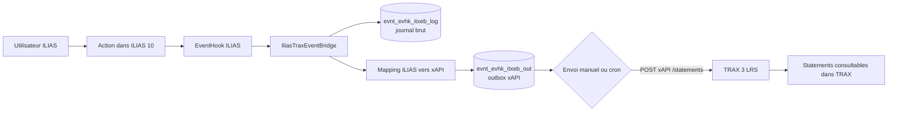
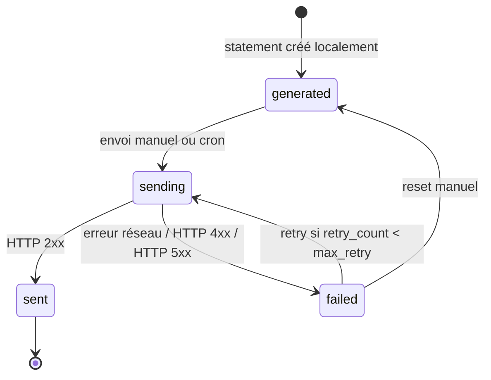

# IliasTraxEventBridge

**IliasTraxEventBridge** est un plugin **ILIAS 10 EventHook** qui transforme certains événements ILIAS en statements **xAPI** et les envoie vers **TRAX 3 LRS**.

La version actuelle du dépôt est **v0.4.0**.

## Fonctionnalités actuelles

Le plugin permet actuellement de :

- capter des événements ILIAS 10 via le slot `Services/EventHandling/EventHook` ;
- journaliser les événements bruts dans une table de debug ;
- générer localement des statements xAPI ;
- exclure les événements d’administration qui ne doivent pas devenir des traces d’apprentissage ;
- stocker les statements dans une outbox locale ;
- configurer TRAX depuis l’interface d’administration du plugin ;
- tester la connexion TRAX ;
- envoyer manuellement les statements vers TRAX ;
- envoyer automatiquement l’outbox vers TRAX via un job cron ILIAS ;
- suivre les statuts d’envoi : `generated`, `sending`, `sent`, `failed` ;
- limiter les tentatives d’envoi avec `retry_count` et `max_retry` ;
- réinitialiser les statements `failed` depuis l’écran d’administration ;
- consulter les diagnostics du dernier test TRAX, du dernier envoi manuel et du dernier cron.

## Événements métier couverts en v0.4.0

| Action ILIAS | Événement détecté | Statement xAPI |
|---|---|---|
| Démarrage d’un test | `Tracking:updateStatus` + `cmd=startTest` | `attempted` |
| Test réussi | `Tracking:updateStatus` + `status=2` ou `percentage=100` | `passed` |
| Test échoué | `Tracking:updateStatus` + `status=3` | `failed` |
| Téléchargement d’un fichier | `ILIASObject:update` + `obj_type=file` + `cmd=sendfile` | `experienced` |

Les actions d’administration comme la suppression des résultats d’un test restent visibles dans le journal brut, mais ne sont pas envoyées dans l’outbox xAPI.

## Nouveautés v0.4.0

La V0.4 introduit l’exploitation automatique de l’outbox :

- un job cron ILIAS `itxeb_send_outbox_to_trax` ;
- un interrupteur **Activer le cron plugin** dans la configuration ;
- une limite **Max retry** ;
- les colonnes `retry_count`, `max_retry`, `last_attempt_at` ;
- un bouton **Réinitialiser les failed** ;
- un diagnostic persistant du dernier passage cron.

Le cron et le bouton manuel utilisent la même logique : seuls les statements `generated` ou `failed` avec `retry_count < max_retry` sont envoyés.

## Architecture fonctionnelle



## Cycle de vie d’un statement



## Installation dans ILIAS 10

Depuis la racine ILIAS :

```bash
mkdir -p public/Customizing/global/plugins/Services/EventHandling/EventHook

git clone https://github.com/vincent-sayah/IliasTraxEventBridge.git \
public/Customizing/global/plugins/Services/EventHandling/EventHook/IliasTraxEventBridge

cd /var/www/ilias
sudo -u apache composer du
sudo -u apache php cli/setup.php build --yes
```

Puis dans ILIAS :

```text
Administration > Plugins > Update > Activate > Configure
```

Selon l’installation, le chemin peut être sans `public/` :

```bash
Customizing/global/plugins/Services/EventHandling/EventHook/IliasTraxEventBridge
```

## Configuration TRAX et cron

Dans l’écran de configuration du plugin :

| Champ | Description |
|---|---|
| Activer le cron plugin | Autorise le job cron du plugin à envoyer l’outbox. Le cron ILIAS global doit aussi être actif. |
| Endpoint xAPI TRAX | Endpoint xAPI racine ou endpoint complet `/statements`. |
| Identifiant client TRAX | Client xAPI TRAX, pas forcément un utilisateur humain. |
| Secret client TRAX | Secret associé au client xAPI. |
| Version xAPI | Recommandé : `1.0.3`. |
| Timeout HTTP | Timeout d’appel HTTP. |
| Taille batch | Nombre maximum de statements envoyés par batch manuel ou cron. |
| Max retry | Nombre maximum de tentatives par statement. |
| Base URL ILIAS forcée | Utilisée pour les IRIs xAPI et `actor.account.homePage`. |

Le plugin ajoute automatiquement `/statements` si l’endpoint fourni ne se termine pas déjà par `/statements`.

### Activation du cron ILIAS

L’option **Activer le cron plugin** n’active pas à elle seule l’exécution planifiée. Elle autorise seulement le plugin à travailler lorsqu’ILIAS exécute son job cron.

Il faut aussi activer et exécuter le job dans ILIAS :

```text
Administration > Paramètres système et maintenance > Tâches cron
```

Chercher le job :

```text
IliasTraxEventBridge — envoi outbox vers TRAX
```

ou l’identifiant technique :

```text
itxeb_send_outbox_to_trax
```

Le cron doit être actif dans ILIAS et le cron système/CLI d’ILIAS doit tourner régulièrement sur le serveur. Sans cela, les statements restent en `generated` jusqu’à un clic manuel sur **Envoyer maintenant**.

## Vérifications SQL utiles

Voir l’outbox xAPI avec les retries :

```sql
SELECT id, created_at, event_type, verb_id, user_id, ref_id, obj_id, obj_type,
       status, retry_count, max_retry, last_attempt_at, sent_at, last_error
FROM evnt_evhk_itxeb_out
ORDER BY id DESC
LIMIT 30;
```

Voir les diagnostics TRAX et cron :

```sql
SELECT keyword, value
FROM settings
WHERE module = 'itxeb'
AND (keyword LIKE 'last_trax_%' OR keyword LIKE 'last_cron_%')
ORDER BY keyword;
```

## Documentation complémentaire

- [README technique](README_TECHNIQUE.md)
- [Changelog](CHANGELOG.md)
- [Guide d’import GitHub](GITHUB_IMPORT.md)
- [Plan de validation](docs/VALIDATION.md)
