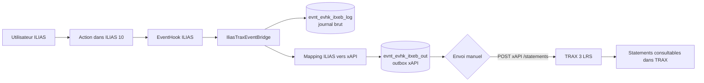
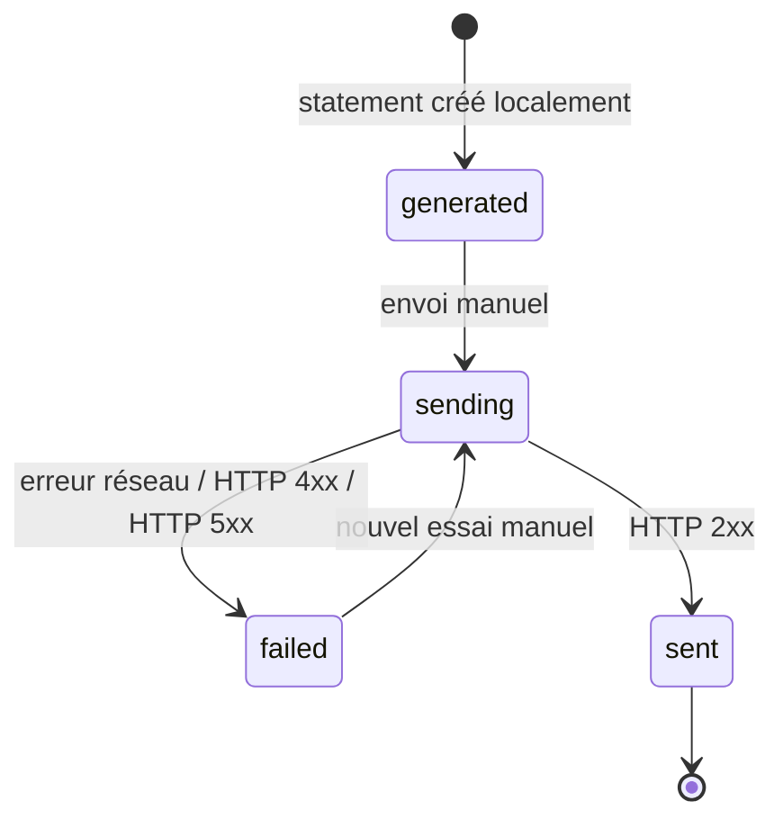
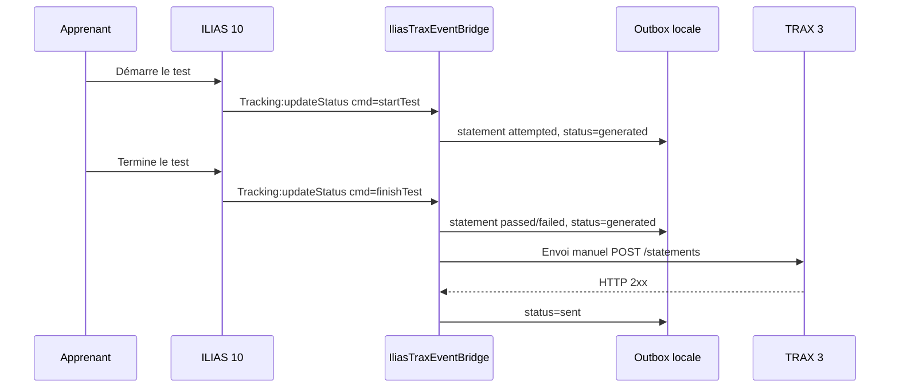
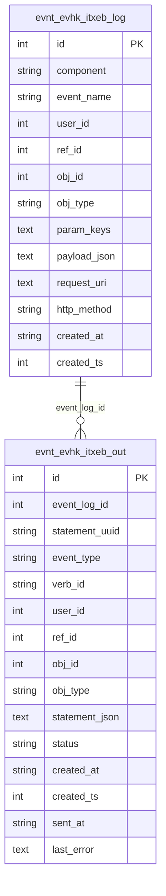

# IliasTraxEventBridge

**IliasTraxEventBridge** est un plugin **ILIAS 10 EventHook** qui transforme certains événements ILIAS en statements **xAPI** et les envoie vers **TRAX 3 LRS**.

La version actuelle du dépôt est **v0.3.1**.

## Fonctionnalités actuelles

Le plugin permet actuellement de :

- capter des événements ILIAS 10 via le slot `Services/EventHandling/EventHook` ;
- journaliser les événements bruts dans une table de debug ;
- générer localement des statements xAPI ;
- exclure les événements d’administration qui ne doivent pas devenir des traces d’apprentissage ;
- stocker les statements dans une outbox locale ;
- configurer TRAX depuis l’interface d’administration du plugin ;
- tester la connexion TRAX ;
- envoyer manuellement les statements vers TRAX ;
- suivre les statuts d’envoi : `generated`, `sending`, `sent`, `failed`.

## Événements métier couverts en v0.3.1

| Action ILIAS | Événement détecté | Statement xAPI |
|---|---|---|
| Démarrage d’un test | `Tracking:updateStatus` + `cmd=startTest` | `attempted` |
| Test réussi | `Tracking:updateStatus` + `status=2` ou `percentage=100` | `passed` |
| Test échoué | `Tracking:updateStatus` + `status=3` | `failed` |
| Téléchargement d’un fichier | `ILIASObject:update` + `obj_type=file` + `cmd=sendfile` | `experienced` |

Les actions d’administration comme la suppression des résultats d’un test restent visibles dans le journal brut, mais ne sont pas envoyées dans l’outbox xAPI.

## Ce qui n’est pas encore couvert

Les actions suivantes ne sont pas encore captées de manière fiable par EventHook seul :

- simple entrée dans un cours ;
- simple ouverture d’un objet sans changement de statut ;
- simple consultation passive d’une ressource déjà validée ;
- temps passé dans un objet.

Ces cas demanderont probablement un mécanisme complémentaire : point d’entrée UI, observer applicatif, lecture de tracking ILIAS, ou instrumentation ciblée.

## Architecture fonctionnelle



## Cycle de vie d’un statement



## Séquence : tentative de test



## Tables utilisées



## Installation dans ILIAS 10

Depuis la racine ILIAS :

```bash
mkdir -p public/Customizing/global/plugins/Services/EventHandling/EventHook

git clone https://github.com/<organisation>/IliasTraxEventBridge.git \
public/Customizing/global/plugins/Services/EventHandling/EventHook/IliasTraxEventBridge

cd /var/www/ilias
sudo -u apache composer du
sudo -u apache php cli/setup.php build --yes
```

Puis dans ILIAS :

```text
Administration > Plugins > Update > Activate > Configure
```

Selon l’installation, le chemin peut être sans `public/` :

```bash
Customizing/global/plugins/Services/EventHandling/EventHook/IliasTraxEventBridge
```

## Configuration TRAX

Dans l’écran de configuration du plugin :

| Champ | Description |
|---|---|
| Endpoint xAPI TRAX | Endpoint xAPI racine ou endpoint complet `/statements` |
| Identifiant client TRAX | Client xAPI TRAX, pas forcément un utilisateur humain |
| Secret client TRAX | Secret associé au client xAPI |
| Version xAPI | Recommandé : `1.0.3` |
| Timeout HTTP | Timeout d’appel HTTP |
| Taille batch manuel | Nombre maximum de statements envoyés par clic |
| Base URL ILIAS forcée | Utilisée pour les IRIs xAPI et `actor.account.homePage` |

Le plugin ajoute automatiquement `/statements` si l’endpoint fourni ne se termine pas déjà par `/statements`.

## Vérifications SQL utiles

Voir les événements ILIAS bruts :

```sql
SELECT id, created_at, component, event_name, user_id, ref_id, obj_id, obj_type, request_uri
FROM evnt_evhk_itxeb_log
ORDER BY id DESC
LIMIT 30;
```

Voir l’outbox xAPI :

```sql
SELECT id, created_at, event_log_id, event_type, verb_id, user_id, ref_id, obj_id, obj_type, status, sent_at, last_error
FROM evnt_evhk_itxeb_out
ORDER BY id DESC
LIMIT 30;
```

Voir les diagnostics TRAX :

```sql
SELECT keyword, value
FROM settings
WHERE module = 'itxeb'
AND keyword LIKE 'last_trax_%'
ORDER BY keyword;
```

## Branches et versions

Le dépôt contient une branche par version :

```text
v0.1.0
v0.1.1
v0.1.2
v0.1.3
v0.1.4
v0.1.5
v0.2.0
v0.2.1
v0.3.0
v0.3.1
```

La branche `main` pointe sur la dernière version documentée.

## Roadmap courte

Prochaine étape prévue : **v0.4**.

Objectifs :

- automatiser l’envoi via cron ILIAS ;
- ajouter `retry_count` et `max_retry` ;
- garder l’envoi manuel comme secours ;
- ajouter un bouton de réinitialisation des `failed` ;
- ajouter un diagnostic d’exploitation plus complet.

## Documentation complémentaire

- [README technique](README_TECHNIQUE.md)
- [Changelog](CHANGELOG.md)
- [Guide d’import GitHub](GITHUB_IMPORT.md)
- [Plan de validation](docs/VALIDATION.md)
