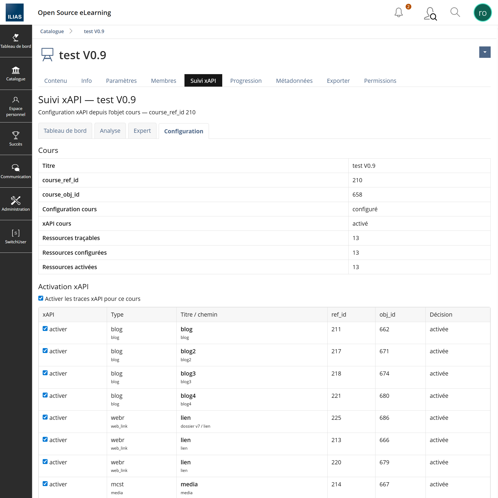
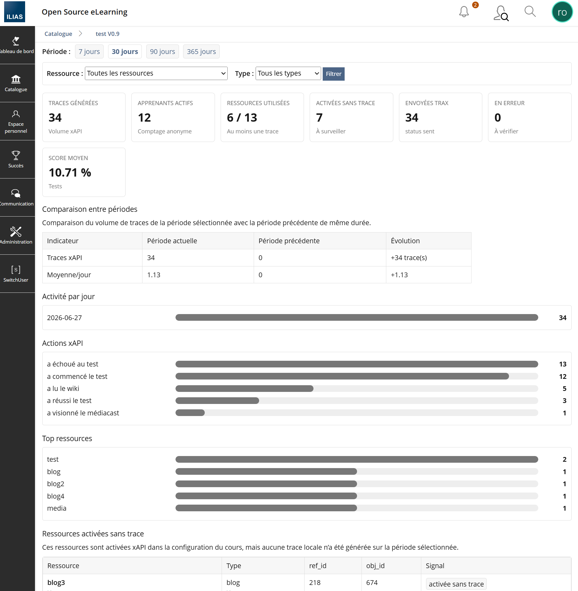
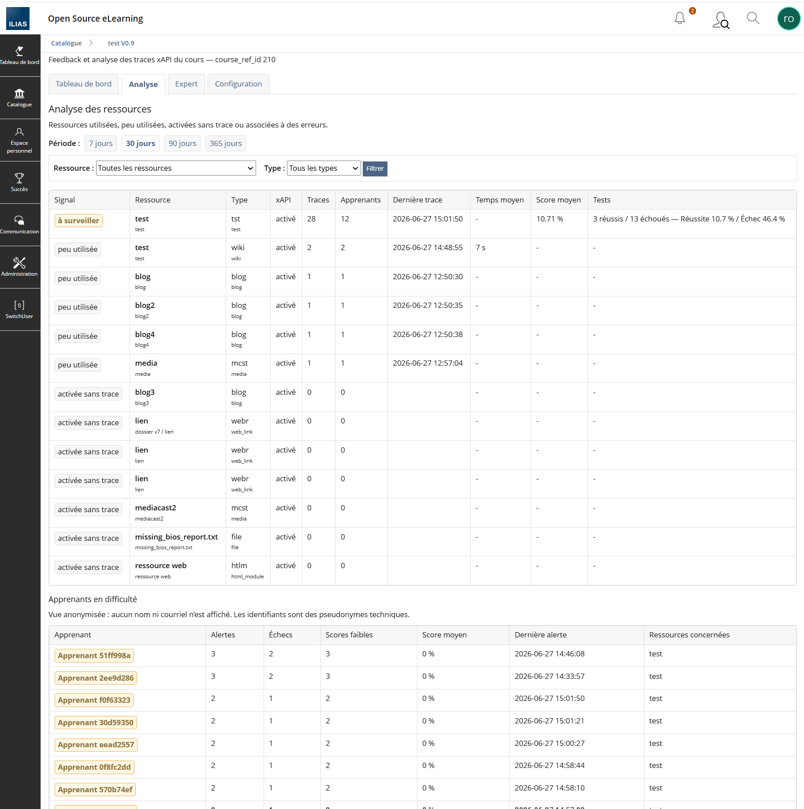
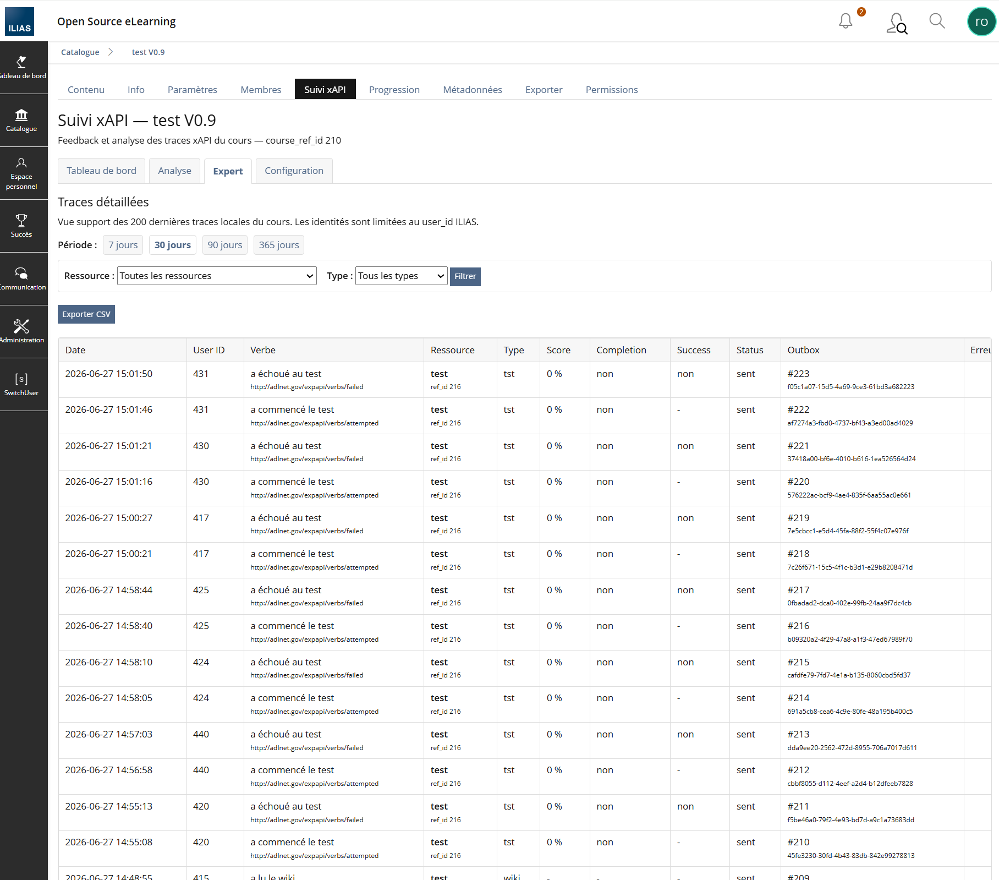

# IliasTraxEventBridge

Plugin ILIAS 10 EventHook permettant de transformer certains événements ILIAS en statements xAPI, de les envoyer vers un LRS xAPI comme TRAX 3, puis d'afficher un suivi xAPI de cours alimenté directement par TRAX/LRS.

## Version stable officielle

| Élément | Valeur |
|---|---|
| Version stable | `0.11.0` |
| Branche stable officielle | `main` |
| Tag stable | `v0.11.0` |
| Branche de développement V0.11 | `v0.11-diagnostic-exploitation` |
| Compatibilité ILIAS | `10.0.0` à `10.999.999` |
| Plugin principal | `IliasTraxEventBridge` |
| Type plugin principal | `EventHook` |
| Plugin compagnon | `IliasTraxEventBridgeCourseUI` |
| Type plugin compagnon | `UIHook` |
| Source pédagogique du suivi xAPI | TRAX/LRS |
| Rôle de l'outbox locale | File technique d'envoi uniquement |

La V0.11.0 est maintenant promue sur `main`. Pour une installation stable, utiliser `main` ou le tag `v0.11.0`.

La V0.11.0 conserve le fonctionnement V0.10.1 et ajoute le durcissement exploitation : diagnostic santé, tests TRAX/LRS, rollback et procédure de validation.

## Documentation complète

Le dossier `docs/` contient maintenant un index dédié : [`docs/README.md`](docs/README.md).

| Document | Rôle |
|---|---|
| [`docs/README.md`](docs/README.md) | Index général de toute la documentation. |
| [`docs/INSTALLATION.md`](docs/INSTALLATION.md) | Installation complète, mise à jour, reconstruction ILIAS, plugin compagnon, contrôles et dépannage. |
| [`docs/FONCTIONNEL.md`](docs/FONCTIONNEL.md) | Documentation fonctionnelle : objectifs, utilisateurs, parcours cours, vues Tableau de bord / Analyse / Expert / Configuration. |
| [`docs/TECHNIQUE.md`](docs/TECHNIQUE.md) | Documentation technique : architecture, EventHook, UIHook, outbox, TRAX/LRS, tables SQL, flux de lecture et d'envoi. |
| [`docs/EXPLOITATION.md`](docs/EXPLOITATION.md) | Exploitation : supervision, cron, tests LRS, requêtes SQL utiles, purge et analyse d'incident. |
| [`docs/DIAGNOSTIC.md`](docs/DIAGNOSTIC.md) | Diagnostic exploitation V0.11 : santé plugin, tables, outbox, TRAX/LRS et cron. |
| [`docs/ROLLBACK.md`](docs/ROLLBACK.md) | Procédure de retour arrière. |
| [`docs/VALIDATION_0.11.md`](docs/VALIDATION_0.11.md) | Procédure complète de validation V0.11. |
| [`docs/DEVELOPPEUR.md`](docs/DEVELOPPEUR.md) | Documentation développeur : classes principales, conventions, migrations, contrôles avant livraison. |
| [`docs/ROADMAP.md`](docs/ROADMAP.md) | Roadmap à jour : V0.12, V0.13, IA d'analyse des traces, API keys IA, sécurité et gouvernance. |
| [`docs/IA_ANALYSE_TRACES.md`](docs/IA_ANALYSE_TRACES.md) | Cadrage détaillé de l'analyse des traces xAPI par IA. |
| [`docs/RELEASE_0.11.0.md`](docs/RELEASE_0.11.0.md) | Note de version stable V0.11.0. |
| [`docs/V0.10_LRS_DIRECT_READ.md`](docs/V0.10_LRS_DIRECT_READ.md) | Décision d'architecture V0.10/V0.11 : lecture directe TRAX/LRS. |
| [`CHANGELOG.md`](CHANGELOG.md) | Historique des versions. |

## Principe d'architecture V0.11.0

```text
ILIAS 10
  ├─ EventHook IliasTraxEventBridge
  │    ├─ capte les événements ILIAS
  │    ├─ génère des statements xAPI
  │    └─ alimente l'outbox locale technique
  │
  ├─ Cron ILIAS
  │    └─ envoie l'outbox vers TRAX/LRS
  │
  └─ UIHook IliasTraxEventBridgeCourseUI
       └─ affiche l'écran Suivi xAPI dans le cours

TRAX / LRS
  ├─ reçoit les statements xAPI
  └─ devient la source officielle des vues pédagogiques
```

Décision centrale :

```text
Outbox locale = file technique d'envoi
TRAX/LRS      = source officielle du suivi xAPI pédagogique
```

L'outbox locale `evnt_evhk_itxeb_out` peut être purgée en exploitation. Elle ne doit donc pas être utilisée comme source fonctionnelle du tableau de bord pédagogique.

## Nouveautés V0.11.0

- Section `Santé / Diagnostic V0.11` dans l'administration du plugin.
- Script serveur non destructif `scripts/diagnostic_itxeb.sh`.
- Test de connexion TRAX.
- Test de lecture TRAX/LRS via `GET /statements?limit=1`, sans création de trace.
- Test d'écriture TRAX/LRS avec création volontaire d'un statement de diagnostic identifiable.
- Persistance des résultats lecture/écriture dans `Diagnostics TRAX / cron`.
- Documentation diagnostic, rollback et validation.

## Fonctionnalités principales

- Captation d'événements ILIAS via EventHook.
- Génération locale de statements xAPI.
- Envoi vers TRAX/LRS via outbox locale.
- Retry technique avec `retry_count`, `max_retry` et `last_attempt_at`.
- Activation stricte par cours et par ressource.
- Accès `Suivi xAPI` depuis l'objet cours via le plugin compagnon UIHook.
- Tableau de bord pédagogique alimenté par TRAX/LRS.
- Analyse des ressources alimentée par TRAX/LRS.
- Vue Expert alimentée par TRAX/LRS.
- Export CSV Expert.
- Export PDF du tableau de bord.
- Diagnostic TRAX/LRS dans l'onglet Configuration.
- Supervision technique de l'outbox dans l'onglet Configuration.

## Vues du suivi xAPI

L'écran de cours contient quatre vues :

```text
Tableau de bord | Analyse | Expert | Configuration
```

| Vue | Rôle |
|---|---|
| Tableau de bord | Synthèse pédagogique : statements TRAX, apprenants actifs, ressources utilisées, score moyen, activité par jour, actions xAPI, top ressources, export PDF. |
| Analyse | Analyse par ressource, ressources sans trace, verbes retournés par TRAX, ressources retournées par TRAX, apprenants en difficulté anonymisés. |
| Expert | Liste détaillée des statements retournés par TRAX/LRS avec export CSV. |
| Configuration | Activation du cours, activation des ressources, préférences dashboard, diagnostic LRS, supervision technique de l'outbox. |

## Écrans

### Configuration du suivi xAPI



### Tableau de bord du suivi xAPI



### Analyse du suivi xAPI



### Vue Expert du suivi xAPI


