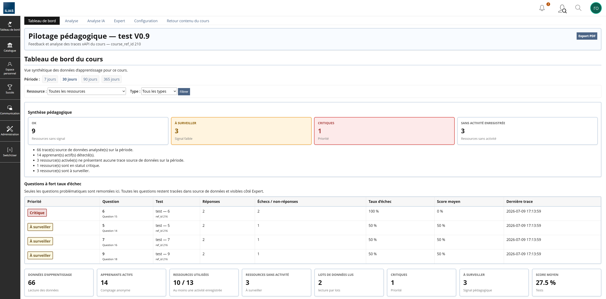
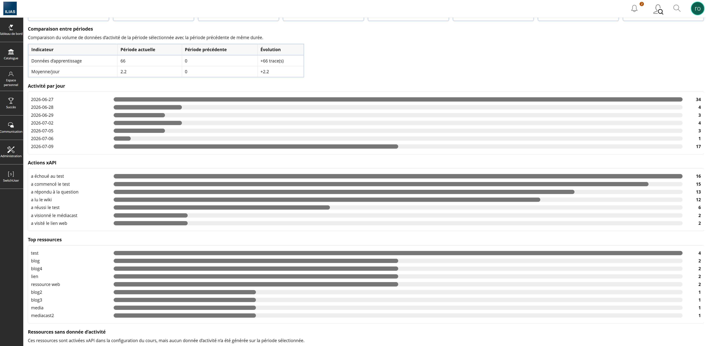
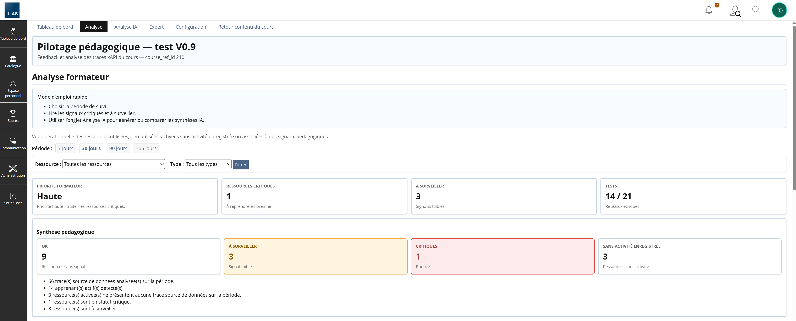
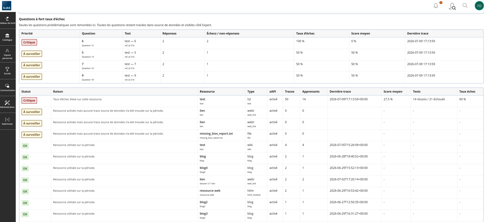
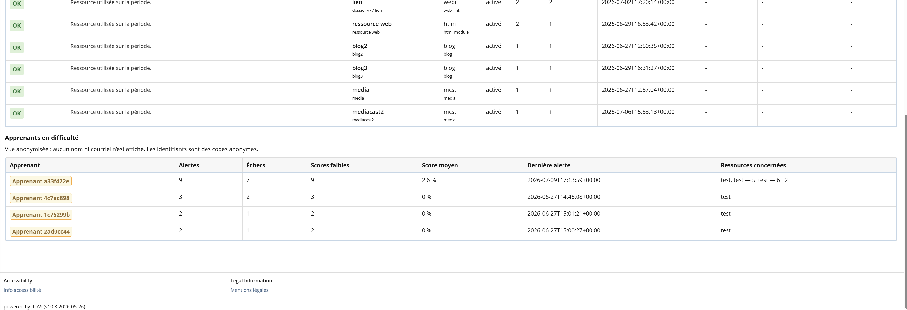
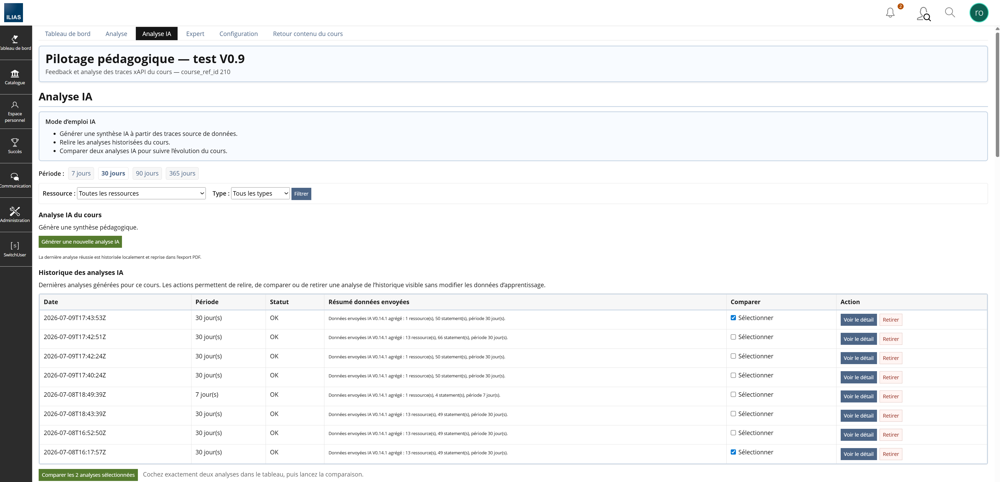
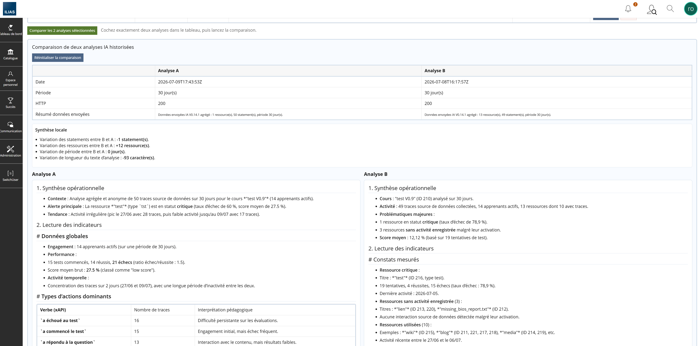
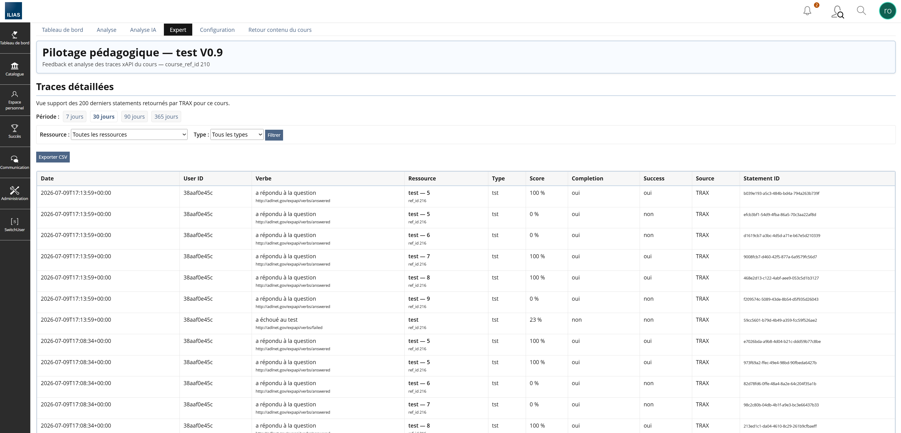
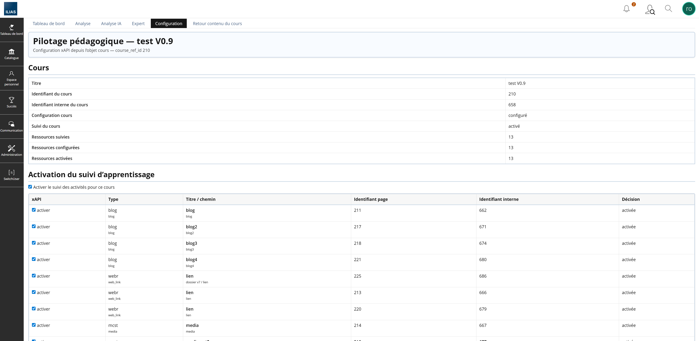

# IliasTraxEventBridge

Plugin ILIAS 10 EventHook permettant de transformer certains événements ILIAS en statements xAPI, de les envoyer vers un LRS xAPI comme TRAX 3, puis d'afficher un pilotage pédagogique de cours dans ILIAS.

## Version stable actuelle

| Élément | Valeur |
|---|---|
| Branche stable officielle | `main` |
| Version stable courante | `0.23.8-dev` validée pour promotion dans `main` |
| Commit de gel fonctionnel | `630ad8e` — `V0.23.8 validate MediaCast analysis view and external titles` |
| Plugin principal | `IliasTraxEventBridge` |
| Type plugin principal | `EventHook` |
| Version plugin compagnon | `0.8.19` |
| Plugin compagnon | `IliasTraxEventBridgeCourseUI` |
| Type plugin compagnon | `UIHook` |
| Compatibilité ILIAS | `10.0.0` à `10.999.999` |
| Branche de développement V0.23 | `v0.23-mediacast-media-tracking` |
| Version stable précédente | `0.22.4-dev` |

Pour une installation stable courante, utiliser `main` après promotion de la V0.23.8 :

```bash
git clone -b main --single-branch https://github.com/vincent-sayah/IliasTraxEventBridge.git IliasTraxEventBridge
```

Ne plus utiliser les anciennes branches d'installation comme `v0.10-lrs-direct-read` pour une nouvelle installation.

## Règle métier V0.23.8

```text
TRAX/LRS = destination xAPI et source principale de suivi pédagogique.
Outbox locale = file technique d'envoi.
MediaCast = suivi des ouvertures, vidéos internes lues et médias externes sélectionnés.
```

Règle fonctionnelle validée :

```text
TRAX = toutes les questions de test ILIAS sont tracées.
Tableau de bord / Analyse = seules les questions problématiques sont remontées.
Analyse IA = seules les questions problématiques sont intégrées au payload IA.
Expert = vision technique complète.
Analyse = vue MediaCast des vidéos internes lues et médias externes ouverts.
```

## Fonctionnalités principales

- Captation d'événements ILIAS via EventHook.
- Génération locale de statements xAPI.
- Envoi vers TRAX/LRS via outbox locale.
- Retry technique avec `retry_count`, `max_retry` et `last_attempt_at`.
- Activation stricte par cours et par ressource.
- Accès `Pilotage xAPI` depuis l'objet cours via le plugin compagnon UIHook.
- Tableau de bord pédagogique.
- Activité dans le temps avec choix d'affichage : 7 jours, 14 jours, 30 jours, par semaine, détail complet.
- Présentation des blocs de type formulaire ILIAS : intitulé à gauche, données à droite.
- Analyse formateur.
- Vue `Médias MediaCast vus` dans l'onglet Analyse uniquement.
- Suivi des vidéos internes MediaCast lancées.
- Suivi des médias externes MediaCast sélectionnés, dont YouTube/Vimeo.
- Affichage du titre réel des médias externes lorsque le titre est disponible dans la playlist MediaCast ILIAS.
- Onglet `Analyse IA` séparé.
- Historique local des analyses IA.
- Comparaison d'analyses IA historisées.
- Retrait contrôlé d'analyses IA historisées avec retour correct sur l'onglet Analyse IA.
- Vue Expert technique.
- Export CSV Expert.
- Export PDF du tableau de bord.
- Diagnostic TRAX/LRS dans l'onglet Configuration.
- Supervision technique de l'outbox.
- Traces question par question pour les tests ILIAS.
- Bloc `Questions à fort taux d’échec` dans Tableau de bord et Analyse.
- Intégration des questions problématiques dans le payload IA.

## Vues du pilotage xAPI

```text
Tableau de bord | Analyse | Analyse IA | Expert | Configuration | Retour contenu du cours
```

| Vue | Rôle |
|---|---|
| Tableau de bord | Synthèse pédagogique du cours, activité dans le temps, ressources, tests, questions problématiques, export PDF. |
| Analyse | Lecture formateur des ressources, priorités, questions à surveiller et médias MediaCast vus. |
| Analyse IA | Génération, historique, comparaison et retrait d'analyses IA. |
| Expert | Vue technique détaillée des statements et export CSV. |
| Configuration | Activation cours/ressources, préférences, diagnostic LRS, supervision outbox. |

## Suivi MediaCast V0.23.8

La V0.23.8 ajoute un suivi pédagogique MediaCast sans modifier le fonctionnement des tests ILIAS.

### Statements générés

| Action utilisateur | Verbe xAPI | Vue concernée |
|---|---|---|
| Ouverture d'un objet MediaCast | verbe de consultation existant | Expert / activité générale |
| Lancement d'une vidéo interne | `played-media` | Expert et Analyse |
| Sélection d'un média externe, par exemple YouTube | `opened-external-media` | Expert et Analyse |

### Affichage formateur

Dans l'onglet `Analyse`, le bloc `Médias MediaCast vus` affiche :

| Colonne | Description |
|---|---|
| Média | Titre de la vidéo interne ou du média externe. |
| Type | `Vidéo interne` ou `Média externe`. |
| Actions | Nombre de lancements ou d'ouvertures. |
| Apprenants | Nombre d'apprenants ayant déclenché l'action. |
| MediaCast | Objet MediaCast parent et `ref_id`. |
| Dernière trace | Dernière date reçue depuis TRAX/LRS. |

Le bloc MediaCast n'est pas affiché dans `Tableau de bord` afin de conserver une synthèse générale. Le détail pédagogique est centralisé dans `Analyse`.

## Architecture synthétique

```text
ILIAS 10
  ├─ EventHook IliasTraxEventBridge
  │    ├─ capte les événements ILIAS
  │    ├─ génère les statements xAPI globaux
  │    ├─ génère les statements question par question
  │    ├─ génère les statements MediaCast client
  │    └─ alimente l'outbox locale technique
  │
  ├─ Cron ILIAS
  │    └─ envoie l'outbox vers TRAX/LRS
  │
  └─ UIHook IliasTraxEventBridgeCourseUI
       ├─ affiche Pilotage xAPI dans le cours
       └─ injecte le suivi MediaCast côté navigateur

TRAX / LRS
  ├─ reçoit les statements xAPI
  └─ reste la cible xAPI officielle et la source de lecture pédagogique
```

## Installation / mise à jour rapide

Depuis le dossier plugin EventHook :

```bash
cd /var/www/ilias/public/Customizing/global/plugins/Services/EventHandling/EventHook/IliasTraxEventBridge

git fetch origin
git checkout main
git pull --ff-only origin main

export ILIAS_ROOT="/var/www/ilias"
export HTTPD_USER="apache"
bash scripts/install_course_ui_companion_with_standalone_fix.sh

systemctl restart php-fpm
systemctl restart httpd
```

Contrôle des versions :

```bash
grep -n "0.23.8-dev\|0.8.19\|Médias MediaCast vus\|ITXEB V0.23.8 external playlist title" \
plugin.php \
companion/IliasTraxEventBridgeCourseUI/plugin.php.tpl \
companion/IliasTraxEventBridgeCourseUI/classes/class.ilIliasTraxEventBridgeCourseUIScreen.php.tpl \
companion/IliasTraxEventBridgeCourseUI/classes/class.ilIliasTraxEventBridgeCourseUIUIHookGUI.php.tpl \
/var/www/ilias/public/Customizing/global/plugins/Services/UIComponent/UserInterfaceHook/IliasTraxEventBridgeCourseUI/plugin.php \
/var/www/ilias/public/Customizing/global/plugins/Services/UIComponent/UserInterfaceHook/IliasTraxEventBridgeCourseUI/classes/class.ilIliasTraxEventBridgeCourseUIScreen.php \
/var/www/ilias/public/Customizing/global/plugins/Services/UIComponent/UserInterfaceHook/IliasTraxEventBridgeCourseUI/classes/class.ilIliasTraxEventBridgeCourseUIUIHookGUI.php
```

## Documentation de référence

| Document | Rôle |
|---|---|
| [`docs/INDEX_0.23.8.md`](docs/INDEX_0.23.8.md) | Index de référence de la V0.23.8. |
| [`docs/RELEASE_0.23.8.md`](docs/RELEASE_0.23.8.md) | Note de release V0.23.8. |
| [`docs/VALIDATION_0.23.8.md`](docs/VALIDATION_0.23.8.md) | Checklist de validation V0.23.8. |
| [`docs/V0.23_MEDIACAST.md`](docs/V0.23_MEDIACAST.md) | Cadrage fonctionnel et technique du suivi MediaCast. |
| [`docs/INDEX_0.22.4.md`](docs/INDEX_0.22.4.md) | Index de référence de la V0.22.4 précédente. |
| [`docs/INSTALLATION.md`](docs/INSTALLATION.md) | Installation et mise à jour depuis `main`, avec `ILIAS_ROOT` personnalisable. |
| [`docs/RELEASE_0.22.4.md`](docs/RELEASE_0.22.4.md) | Note de release V0.22.4. |
| [`docs/V0.22_ACTIVITY_TIMELINE.md`](docs/V0.22_ACTIVITY_TIMELINE.md) | Cadrage du bloc Activité dans le temps. |
| [`docs/V0.22.1_ILIAS_LIKE_DASHBOARD_LAYOUT.md`](docs/V0.22.1_ILIAS_LIKE_DASHBOARD_LAYOUT.md) | Cadrage de la présentation type formulaire ILIAS. |
| [`docs/FONCTIONNEL_0.21.2.md`](docs/FONCTIONNEL_0.21.2.md) | Base fonctionnelle V0.21.2, complétée par les releases suivantes. |
| [`docs/TECHNIQUE_0.21.2.md`](docs/TECHNIQUE_0.21.2.md) | Base technique V0.21.2, complétée par les releases suivantes. |
| [`docs/GUIDE_DEVELOPPEUR_0.21.2.md`](docs/GUIDE_DEVELOPPEUR_0.21.2.md) | Guide développeur : classes, tables, flux. |
| [`docs/EXPLOITATION_0.21.2.md`](docs/EXPLOITATION_0.21.2.md) | Exploitation et diagnostic courant. |
| [`CHANGELOG.md`](CHANGELOG.md) | Historique des versions. |

Les documents `V0.10`, `V0.11`, `V0.12`, `V0.13`, `RELEASE_0.15.2`, `V0.21.2` et `V0.22.4` sont conservés pour historique et continuité. Pour une installation ou une maintenance courante, utiliser `main` et les documents V0.23.8.

## Copie écran

















