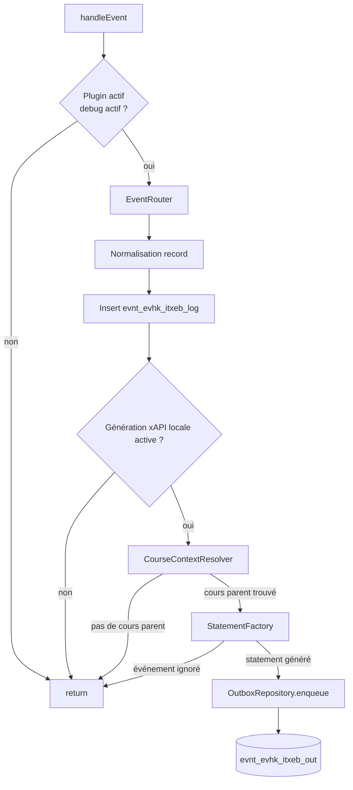

# README technique — IliasTraxEventBridge

## Type de plugin

Le plugin est un plugin ILIAS de type :

```text
Services/EventHandling/EventHook
```

Chemin d’installation attendu :

```text
public/Customizing/global/plugins/Services/EventHandling/EventHook/IliasTraxEventBridge
```

Classe principale :

```text
classes/class.ilIliasTraxEventBridgePlugin.php
```

La méthode appelée par ILIAS 10 est :

```php
public function handleEvent(string $a_component, string $a_event, array $a_parameter): void
```

## Organisation des classes

| Classe | Rôle |
|---|---|
| `ilIliasTraxEventBridgePlugin` | Point d’entrée EventHook ILIAS |
| `ilIliasTraxEventBridgeConfigGUI` | Écran de configuration du plugin |
| `ilIliasTraxEventBridgeConfig` | Lecture/écriture des paramètres via `ilSetting` |
| `ilIliasTraxEventBridgeEventRouter` | Normalisation, filtrage cours et routage des événements ILIAS |
| `ilIliasTraxEventBridgeCourseContextResolver` | Résolution du cours parent d’un objet ILIAS |
| `ilIliasTraxEventBridgeEventDebugRepository` | Persistance du journal brut |
| `ilIliasTraxEventBridgeStatementFactory` | Mapping événement ILIAS vers statement xAPI |
| `ilIliasTraxEventBridgeOutboxRepository` | Stockage et statut d’envoi des statements |
| `ilIliasTraxEventBridgeOutboxSender` | Service d’envoi partagé par action manuelle et cron |
| `ilIliasTraxEventBridgeCron` | Job cron ILIAS d’envoi outbox vers TRAX |
| `ilIliasTraxEventBridgeTraxClient` | Client HTTP xAPI/TRAX |
| `ilIliasTraxEventBridgeHttpResult` | Objet résultat HTTP |

## Flux interne v0.5



Le point important de la V0.5 est que le journal brut reste alimenté, même si l’objet n’est pas dans un cours. Le filtre agit uniquement avant la génération xAPI et l’ajout dans l’outbox.

## Filtre “objet contenu dans un cours uniquement”

Le service `ilIliasTraxEventBridgeCourseContextResolver` tente de confirmer un cours parent de façon conservative :

1. utiliser le `ref_id` détecté dans l’événement ou dans l’URI ;
2. si le `ref_id` est absent, tenter de retrouver les références de l’`obj_id` via `ilObject::_getAllReferences()` ;
3. lire le chemin complet du repository avec `$tree->getPathFull($ref_id)` ;
4. à défaut, remonter les parents avec `$tree->getParentId()` et vérifier les types via `ilObject::_lookupType()`.

Un statement xAPI n’est généré que si un parent de type `crs` est trouvé. Les objets directement placés en catégorie, dans un dossier hors cours ou dans un autre contexte non cours sont donc exclus de l’outbox.

Quand le cours parent est identifié, le record est enrichi avec :

```text
course_ref_id
course_obj_id
```

Ces valeurs sont ajoutées dans les extensions du statement xAPI.

## Normalisation des événements

Le routeur tente de récupérer :

- `user_id` depuis `usr_id`, `user_id`, utilisateur global ILIAS ;
- `ref_id` depuis les paramètres ou depuis `REQUEST_URI` ;
- `obj_id` depuis les paramètres ;
- `obj_type` depuis les paramètres ou depuis `cmdClass`.

Exemples de correspondance `cmdClass` :

| `cmdClass` | `obj_type` |
|---|---|
| `ilObjFileGUI` | `file` |
| `ilTestPlayerFixedQuestionSetGUI` | `tst` |
| `ilObjCourseGUI` | `crs` |
| `ilObjWikiGUI` | `wiki` |
| `ilObjFileBasedLMGUI` | `htlm` |

## Mapping xAPI actuel

### Téléchargement de fichier

Condition :

```text
component = components/ILIAS/ILIASObject
event     = update
obj_type  = file
URI       contient cmd=sendfile
cours parent trouvé
```

Statement :

```text
verb = http://adlnet.gov/expapi/verbs/experienced
event_type = file_downloaded
```

### Début de test

Condition :

```text
component = components/ILIAS/Tracking
event     = updateStatus
URI       contient cmd=startTest
cours parent trouvé
```

Statement :

```text
verb = http://adlnet.gov/expapi/verbs/attempted
event_type = test_tracking_status
```

### Fin de test réussie

Condition :

```text
status = 2
ou percentage = 100
cours parent trouvé
```

Statement :

```text
verb = http://adlnet.gov/expapi/verbs/passed
result.success = true
result.completion = true
```

### Fin de test échouée

Condition :

```text
status = 3
cours parent trouvé
```

Statement :

```text
verb = http://adlnet.gov/expapi/verbs/failed
result.success = false
```

## Événements ignorés pour l’outbox

Ces événements restent dans `evnt_evhk_itxeb_log`, mais ne produisent pas de statement xAPI :

```text
cmdClass=ilTestParticipantsGUI
pt_action=delete_results
cmd=executeTableAction
objet sans cours parent confirmé
```

Objectif : éviter d’envoyer vers TRAX des actions d’administration ou des traces hors périmètre cours comme des traces d’apprentissage.

## Structure d’un statement généré

Exemple simplifié :

```json
{
  "id": "uuid",
  "actor": {
    "objectType": "Agent",
    "account": {
      "homePage": "http://ilias.example.local",
      "name": "ilias-user-328"
    }
  },
  "verb": {
    "id": "http://adlnet.gov/expapi/verbs/passed",
    "display": {
      "fr-FR": "a réussi",
      "en-US": "passed"
    }
  },
  "object": {
    "id": "http://ilias.example.local/xapi/activity/tst/ref/137",
    "objectType": "Activity"
  },
  "context": {
    "platform": "ILIAS 10",
    "extensions": {
      "http://ilias.example.local/xapi/extensions/course_ref_id": 42,
      "http://ilias.example.local/xapi/extensions/course_obj_id": 1234
    }
  }
}
```

## Tables SQL

Les tables sont créées par :

```text
sql/dbupdate.php
```

### `evnt_evhk_itxeb_log`

Journal de diagnostic des événements reçus.

Cette table sert à comprendre ce qu’ILIAS émet réellement. En V0.5, elle reste alimentée y compris pour les objets hors cours.

### `evnt_evhk_itxeb_out`

Outbox xAPI.

Statuts possibles :

```text
generated
sending
sent
failed
```

Le filtre cours n’ajoute pas de colonne SQL : le contexte cours est porté dans le JSON xAPI sous forme d’extensions.

## Configuration stockée dans `settings`

Module :

```text
itxeb
```

Paramètres principaux :

| Clé | Rôle |
|---|---|
| `trax_endpoint` | Endpoint xAPI TRAX |
| `trax_username` | Identifiant client xAPI |
| `trax_password` | Secret client xAPI |
| `xapi_version` | Version xAPI |
| `http_timeout` | Timeout HTTP |
| `batch_size` | Taille d’un envoi manuel ou cron |
| `max_retry` | Nombre maximum de tentatives d’envoi |
| `cron_enabled` | Autorisation plugin du cron d’envoi |
| `ilias_base_url` | Base URL utilisée dans les IRIs |
| `last_trax_test_*` | Dernier diagnostic test connexion |
| `last_trax_send_*` | Dernier diagnostic envoi manuel |
| `last_cron_*` | Dernier diagnostic cron |

## Client HTTP TRAX

Classe :

```text
ilIliasTraxEventBridgeTraxClient
```

Méthodes :

```php
testConnection()
sendStatements(array $statements)
```

Requête d’envoi :

```http
POST <endpoint>/statements
Authorization: Basic <client:secret>
Content-Type: application/json
Accept: application/json
X-Experience-API-Version: 1.0.3
```

Payload :

```json
[
  {
    "actor": {},
    "verb": {},
    "object": {}
  }
]
```

## Recommandations avant production

- Ne pas envoyer prénom, nom, e-mail ou login par défaut.
- Utiliser `actor.account.name = ilias-user-<usr_id>` ou un hash.
- Utiliser HTTPS vers TRAX.
- Limiter les droits du client TRAX à l’écriture xAPI nécessaire.
- Valider le filtre cours sur des objets placés dans un cours, dans une catégorie et dans un dossier hors cours.
- Activer un cron uniquement après validation manuelle.
- Nettoyer périodiquement les tables debug en production.
- Ajouter une gestion de rétention de l’outbox.

## Roadmap technique v0.5

- ajouter les paramètres de cours permettant à l’administrateur du cours d’activer ou désactiver l’envoi xAPI ;
- ajouter le choix des types d’objets traçables au niveau du cours ;
- étendre la couverture à blog, forum, lien web, mediacast, wiki, module web et module SCORM ;
- améliorer les diagnostics du filtre cours dans l’interface d’administration.
