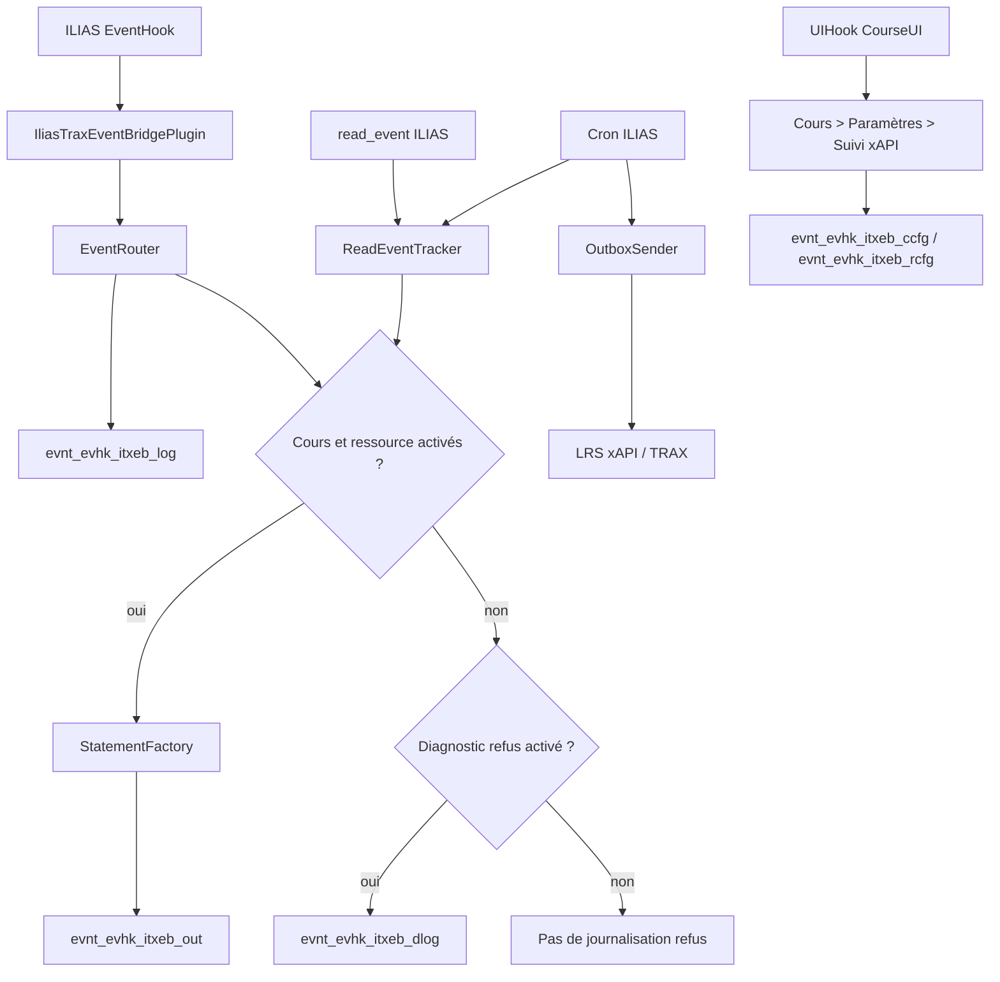

# README technique — IliasTraxEventBridge

Version stable publiée : **v0.8.0** sur `main`, plugin principal **0.8.0**.

Plugin compagnon UIHook : **IliasTraxEventBridgeCourseUI 0.1.1**.

## 1. Type de plugin

Le plugin principal est un plugin ILIAS de type :

```text
Services/EventHandling/EventHook
```

Chemin d'installation attendu :

```text
public/Customizing/global/plugins/Services/EventHandling/EventHook/IliasTraxEventBridge
```

Classe principale :

```text
classes/class.ilIliasTraxEventBridgePlugin.php
```

Méthode appelée par ILIAS 10 :

```php
public function handleEvent(string $a_component, string $a_event, array $a_parameter): void
```

Le plugin compagnon est un plugin ILIAS de type :

```text
Services/UIComponent/UserInterfaceHook
```

Chemin d'installation actif :

```text
public/Customizing/global/plugins/Services/UIComponent/UserInterfaceHook/IliasTraxEventBridgeCourseUI
```

## 2. Architecture V0.8



## 3. Règle de filtrage

La règle métier V0.8 est héritée de la V0.7 :

```text
statement xAPI autorisé = cours activé ET ressource activée
```

Si le cours ou la ressource n'est pas explicitement activé, aucune ligne n'est insérée dans `evnt_evhk_itxeb_out`.

Depuis la V0.8, le refus peut être journalisé dans `evnt_evhk_itxeb_dlog`, mais uniquement si l'option de diagnostic est activée.

## 4. Tables SQL

| Table | Rôle |
|---|---|
| `evnt_evhk_itxeb_log` | Journal brut des événements EventHook reçus |
| `evnt_evhk_itxeb_out` | Outbox locale des statements xAPI |
| `evnt_evhk_itxeb_read` | Suivi anti-doublon des consultations issues de `read_event` |
| `evnt_evhk_itxeb_ccfg` | Configuration xAPI par cours |
| `evnt_evhk_itxeb_rcfg` | Configuration xAPI par ressource dans un cours |
| `evnt_evhk_itxeb_dlog` | Diagnostic V0.8 des traces refusées |

Étapes SQL principales :

```text
<#5> tables de configuration cours/ressources : ccfg, rcfg
<#6> table de diagnostic des refus : dlog
```

## 5. Classes principales

| Classe | Rôle |
|---|---|
| `ilIliasTraxEventBridgePlugin` | Point d'entrée EventHook ILIAS |
| `ilIliasTraxEventBridgeConfig` | Lecture/écriture de la configuration via `ilSetting` |
| `ilIliasTraxEventBridgeConfigGUI` | Écran admin, supervision, actions manuelles, diagnostic refus |
| `ilIliasTraxEventBridgeEventRouter` | Normalisation, résolution cours, filtrage, outbox ou refus |
| `ilIliasTraxEventBridgeEventDebugRepository` | Journal brut `evnt_evhk_itxeb_log` |
| `ilIliasTraxEventBridgeCourseContextResolver` | Résolution du cours parent |
| `ilIliasTraxEventBridgeCourseTrackingRepository` | Lecture/écriture `ccfg` et `rcfg` |
| `ilIliasTraxEventBridgeCourseResourceResolver` | Liste des ressources traçables d'un cours |
| `ilIliasTraxEventBridgeCourseTrackingGUI` | Écran de configuration xAPI par cours côté admin |
| `ilIliasTraxEventBridgeStatementFactory` | Mapping événements/consultations vers statements xAPI |
| `ilIliasTraxEventBridgeOutboxRepository` | Gestion de l'outbox, compteurs et statuts |
| `ilIliasTraxEventBridgeOutboxSender` | Envoi xAPI manuel ou cron |
| `ilIliasTraxEventBridgeCron` | Job cron ILIAS |
| `ilIliasTraxEventBridgeReadEventTracker` | Traitement de la table ILIAS `read_event` |
| `ilIliasTraxEventBridgeDenyLogRepository` | Journalisation/purge des refus V0.8 |
| `ilIliasTraxEventBridgeTraxClient` | Client HTTP xAPI/TRAX |
| `ilIliasTraxEventBridgeHttpResult` | Résultat HTTP normalisé |

## 6. Plugin compagnon CourseUI

Le plugin compagnon expose :

```text
Cours > Paramètres > Suivi xAPI
```

Classes générées dans le slot UIHook :

```text
class.ilIliasTraxEventBridgeCourseUIPlugin.php
class.ilIliasTraxEventBridgeCourseUIBridge.php
class.ilIliasTraxEventBridgeCourseUIScreen.php
class.ilIliasTraxEventBridgeCourseUIUIHookGUI.php
```

Dans le dépôt principal, ces fichiers sont conservés en templates `.php.tpl` pour éviter les doublons Composer :

```text
companion/IliasTraxEventBridgeCourseUI/plugin.php.tpl
companion/IliasTraxEventBridgeCourseUI/classes/*.php.tpl
```

Installation/régénération :

```bash
cd /var/www/ilias/public/Customizing/global/plugins/Services/EventHandling/EventHook/IliasTraxEventBridge
bash scripts/install_course_ui_companion.sh
```

## 7. Installation technique V0.8.0

```bash
sudo -i

export ILIAS_ROOT="/var/www/ilias"
export EVENTHOOK_DIR="$ILIAS_ROOT/public/Customizing/global/plugins/Services/EventHandling/EventHook"
export PLUGIN_NAME="IliasTraxEventBridge"

mkdir -p "$EVENTHOOK_DIR"
cd "$EVENTHOOK_DIR"

git clone -b main --single-branch https://github.com/vincent-sayah/IliasTraxEventBridge.git "$PLUGIN_NAME"
cd "$PLUGIN_NAME"

# Verrouillage exact sur la release stable
git checkout v0.8.0

grep -n '\$version' plugin.php
find . -name "*.php" -print0 | xargs -0 -n1 php -l
bash scripts/install_course_ui_companion.sh

cd "$ILIAS_ROOT"
sudo -u apache composer du
sudo -u apache php cli/setup.php build --yes
systemctl restart httpd
```

Résultat attendu :

```text
$version = "0.8.0";
```

## 8. Mise à jour technique d'une installation existante

```bash
sudo -i

cd /var/www/ilias/public/Customizing/global/plugins/Services/EventHandling/EventHook/IliasTraxEventBridge

git fetch origin --prune --tags
git checkout v0.8.0

grep -n '\$version' plugin.php
find . -name "*.php" -print0 | xargs -0 -n1 php -l
bash scripts/install_course_ui_companion.sh

cd /var/www/ilias
sudo -u apache composer du
sudo -u apache php cli/setup.php build --yes
systemctl restart httpd
```

Dans ILIAS, lancer `Mettre à jour` sur le plugin principal si proposé afin d'appliquer la migration SQL `<#6>`.

## 9. Cron

Job ILIAS :

```text
IliasTraxEventBridge — envoi outbox vers TRAX
```

Identifiant technique :

```text
itxeb_send_outbox_to_trax
```

Le cron traite deux choses :

1. les consultations `read_event` filtrées par configuration cours/ressource ;
2. l'envoi des lignes outbox `generated` ou `failed` éligibles au retry.

## 10. Diagnostic des refus V0.8

Option admin :

```text
Activer le diagnostic des traces refusées
```

Comportement :

```text
case décochée : aucun nouveau refus n'est écrit dans evnt_evhk_itxeb_dlog
case cochée   : les refus sont journalisés dans evnt_evhk_itxeb_dlog
```

Motifs principaux :

```text
not_in_course
missing_course_context
missing_resource_context
course_not_configured
course_disabled
resource_not_configured
resource_disabled
unsupported_object_type
```

Bouton de purge :

```text
Purger le diagnostic des traces refusées
```

Ce bouton vide uniquement `evnt_evhk_itxeb_dlog`.

## 11. Contrôles SQL utiles

```sql
SHOW TABLES LIKE 'evnt_evhk_itxeb_%';

SELECT status, COUNT(*) AS total
FROM evnt_evhk_itxeb_out
GROUP BY status;

SELECT reason, COUNT(*) AS total
FROM evnt_evhk_itxeb_dlog
GROUP BY reason
ORDER BY total DESC, reason ASC;
```

## 12. Documentation liée

```text
README.md
CHANGELOG.md
docs/RELEASE_0.8.0.md
docs/VALIDATION.md
docs/OPERATIONS.md
docs/V0.8_LOT1_DENY_LOG.md
docs/V0.8_LOT2_DENY_SUPERVISION.md
docs/V0.8_LOT3_COMPANION_PACKAGING.md
```
