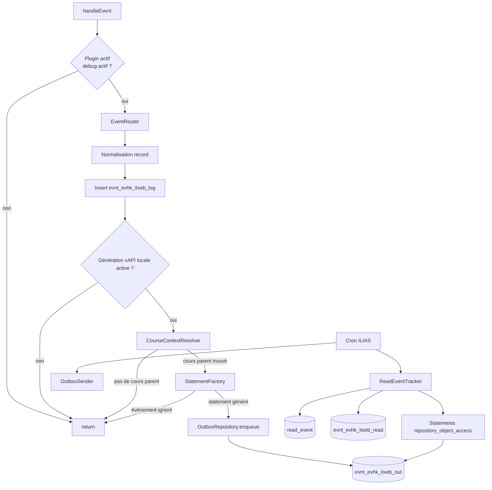

# README technique — IliasTraxEventBridge

Version stable actuelle : **v0.5.5**.

## Type de plugin

Le plugin est un plugin ILIAS de type :

```text
Services/EventHandling/EventHook
```

Chemin d'installation attendu :

```text
public/Customizing/global/plugins/Services/EventHandling/EventHook/IliasTraxEventBridge
```

Classe principale :

```text
classes/class.ilIliasTraxEventBridgePlugin.php
```

Méthode appelée par ILIAS 10 :

```php
public function handleEvent(string $a_component, string $a_event, array $a_parameter): void
```

## Version stable v0.5.5

La V0.5.5 est la version stable courante. Elle stabilise :

- le filtrage métier « objet contenu dans un cours uniquement » ;
- la génération de statements xAPI pour tests et fichiers dans un cours ;
- la détection des consultations réelles d'objets via `read_event` ;
- l'envoi manuel et l'envoi cron vers TRAX ;
- l'anti-doublon de consultation via `evnt_evhk_itxeb_read` ;
- l'exclusion des statements parasites `root` et `crs` issus de `Tracking:updateStatus` génériques.

## Organisation des classes

| Classe | Rôle |
|---|---|
| `ilIliasTraxEventBridgePlugin` | Point d'entrée EventHook ILIAS |
| `ilIliasTraxEventBridgeConfigGUI` | Écran de configuration du plugin |
| `ilIliasTraxEventBridgeConfig` | Lecture/écriture des paramètres via `ilSetting` |
| `ilIliasTraxEventBridgeEventRouter` | Normalisation, filtrage cours et routage des événements ILIAS |
| `ilIliasTraxEventBridgeCourseContextResolver` | Résolution du cours parent d'un objet ILIAS |
| `ilIliasTraxEventBridgeEventDebugRepository` | Persistance du journal brut |
| `ilIliasTraxEventBridgeStatementFactory` | Mapping événement ILIAS ou consultation `read_event` vers statement xAPI |
| `ilIliasTraxEventBridgeOutboxRepository` | Stockage et statut d'envoi des statements |
| `ilIliasTraxEventBridgeOutboxSender` | Service d'envoi partagé par action manuelle et cron |
| `ilIliasTraxEventBridgeCron` | Job cron ILIAS d'envoi outbox vers TRAX et génération des consultations `read_event` |
| `ilIliasTraxEventBridgeReadEventTracker` | Détection des consultations réelles d'objets via la table ILIAS `read_event` |
| `ilIliasTraxEventBridgeTraxClient` | Client HTTP xAPI/TRAX |
| `ilIliasTraxEventBridgeHttpResult` | Objet résultat HTTP |

## Installation technique

Exemple avec ILIAS dans `/var/www/ilias` :

```bash
sudo -i

export ILIAS_ROOT="/var/www/ilias"
export EVENTHOOK_DIR="$ILIAS_ROOT/public/Customizing/global/plugins/Services/EventHandling/EventHook"
export PLUGIN_NAME="IliasTraxEventBridge"

mkdir -p "$EVENTHOOK_DIR"
cd "$EVENTHOOK_DIR"

git clone -b main --single-branch https://github.com/vincent-sayah/IliasTraxEventBridge.git "$PLUGIN_NAME"

cd "$PLUGIN_NAME"
grep -n '\$version' plugin.php

chown -R apache:apache "$EVENTHOOK_DIR/$PLUGIN_NAME"
find "$EVENTHOOK_DIR/$PLUGIN_NAME" -type d -exec chmod 755 {} \;
find "$EVENTHOOK_DIR/$PLUGIN_NAME" -type f -exec chmod 644 {} \;
find "$EVENTHOOK_DIR/$PLUGIN_NAME" -name "*.php" -print0 | xargs -0 -n1 php -l

cd "$ILIAS_ROOT"
sudo -u apache composer du
sudo -u apache php cli/setup.php build --yes
```

Puis dans ILIAS :

```text
Administration > Plugins > EventHook > IliasTraxEventBridge > Installer / Mettre à jour > Activer > Configurer
```

## Mise à jour technique

```bash
sudo -i

cd /var/www/ilias/public/Customizing/global/plugins/Services/EventHandling/EventHook/IliasTraxEventBridge

git fetch origin
git checkout main
git pull --ff-only origin main

grep -n '\$version' plugin.php

cd /var/www/ilias
sudo -u apache composer du
sudo -u apache php cli/setup.php build --yes
```

Puis dans ILIAS :

```text
Administration > Plugins > EventHook > IliasTraxEventBridge > Mettre à jour
```

## Flux interne v0.5.5



Le journal brut reste alimenté même si l'objet n'est pas dans un cours. Le filtre agit uniquement avant la génération xAPI et l'ajout dans l'outbox.

## Filtre “objet contenu dans un cours uniquement”

Le service `ilIliasTraxEventBridgeCourseContextResolver` tente de confirmer un cours parent de façon conservative :

1. utiliser le `ref_id` détecté dans l'événement ou dans l'URI ;
2. si le `ref_id` est absent, tenter de retrouver les références de l'`obj_id` via `ilObject::_getAllReferences()` ;
3. lire le chemin complet du repository avec `$tree->getPathFull($ref_id)` ;
4. accepter le cas où le `ref_id` reçu est lui-même un cours, notamment lors de la création d'un objet dans un cours ;
5. à défaut, remonter les parents avec `$tree->getParentId()` et vérifier les types via `ilObject::_lookupType()`.

Un statement xAPI n'est généré que si un contexte cours est trouvé. Les objets directement placés en catégorie, dans un dossier hors cours ou dans un autre contexte non cours sont donc exclus de l'outbox.

Quand le cours parent est identifié, le record est enrichi avec :

```text
course_ref_id
course_obj_id
```

Ces valeurs sont ajoutées dans les extensions du statement xAPI.

## Tracking `read_event`

La table ILIAS `read_event` est utilisée pour détecter l'exploitation réelle des objets de dépôt. Le cron lit les consultations, vérifie que l'objet est contenu dans un cours, puis ajoute un statement `repository_object_access` dans l'outbox.

La table locale suivante évite les doublons :

```text
evnt_evhk_itxeb_read
```

Elle mémorise :

```text
obj_id
usr_id
last_access
read_count
processed_at
```

Le plugin génère une nouvelle trace si `last_access` ou `read_count` a évolué depuis le dernier traitement.

## Normalisation des événements

Le routeur tente de récupérer :

- `user_id` depuis `usr_id`, `user_id`, utilisateur global ILIAS ;
- `ref_id` depuis les paramètres ou depuis `REQUEST_URI` ;
- `obj_id` depuis les paramètres ;
- `obj_type` depuis les paramètres, l'URI, `cmdClass`, ou en secours via les méthodes ILIAS de lookup.

Exemples de correspondance `cmdClass` :

| `cmdClass` | `obj_type` |
|---|---|
| `ilObjFileGUI` | `file` |
| `ilTestPlayerFixedQuestionSetGUI` | `tst` |
| `ilObjCourseGUI` | `crs` |
| `ilObjWikiGUI` | `wiki` |
| `ilObjFileBasedLMGUI` | `htlm` |
| `ilObjBlogGUI` | `blog` |
| `ilObjWebResourceGUI` | `webr` |
| `ilObjMediaCastGUI` | `mcst` |

## Mapping xAPI stable

| Source | Condition | `event_type` |
|---|---|---|
| EventHook test | `Tracking:updateStatus` sur un objet `tst` dans un cours | `test_tracking_status` |
| EventHook fichier | `cmd=sendfile` sur un objet `file` dans un cours | `file_downloaded` |
| `read_event` | consultation d'un objet supporté dans un cours | `repository_object_access` |

Les événements `Tracking:updateStatus` génériques sur `crs` ou `root` ne génèrent plus de statements xAPI en v0.5.5.

## Tables principales

| Table | Rôle |
|---|---|
| `evnt_evhk_itxeb_log` | Journal brut des événements EventHook reçus |
| `evnt_evhk_itxeb_out` | Outbox locale des statements xAPI |
| `evnt_evhk_itxeb_read` | Pointeur anti-doublon pour les consultations `read_event` |
| `read_event` | Table ILIAS utilisée comme source de consultation réelle |

## Vérifications SQL

Outbox récente :

```sql
SELECT id, event_log_id, event_type, obj_type, ref_id, obj_id,
       user_id, status, retry_count, created_at, sent_at, last_error
FROM evnt_evhk_itxeb_out
ORDER BY id DESC
LIMIT 20;
```

Consultations déjà traitées :

```sql
SELECT *
FROM evnt_evhk_itxeb_read
ORDER BY processed_at DESC
LIMIT 20;
```

Absence de pollution `root` / `crs` :

```sql
SELECT id, event_log_id, event_type, obj_type, ref_id, obj_id,
       user_id, status, created_at, sent_at
FROM evnt_evhk_itxeb_out
WHERE obj_type IN ('root', 'crs')
ORDER BY id DESC
LIMIT 20;
```
