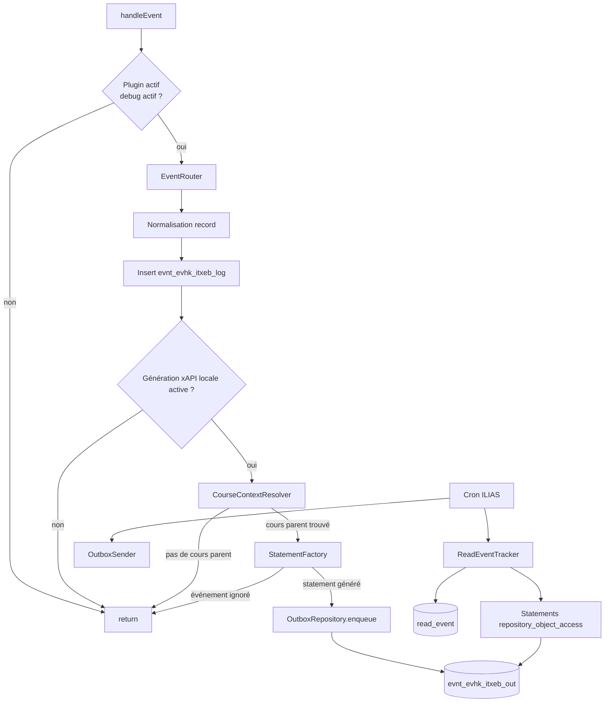

# README technique — IliasTraxEventBridge

Version stable actuelle : **v0.5.5**.

## Type de plugin

Le plugin est un plugin ILIAS de type :

```text
Services/EventHandling/EventHook
```

Chemin d’installation attendu :

```text
public/Customizing/global/plugins/Services/EventHandling/EventHook/IliasTraxEventBridge
```

Classe principale :

```text
classes/class.ilIliasTraxEventBridgePlugin.php
```

La méthode appelée par ILIAS 10 est :

```php
public function handleEvent(string $a_component, string $a_event, array $a_parameter): void
```

## Organisation des classes

| Classe | Rôle |
|---|---|
| `ilIliasTraxEventBridgePlugin` | Point d’entrée EventHook ILIAS |
| `ilIliasTraxEventBridgeConfigGUI` | Écran de configuration du plugin |
| `ilIliasTraxEventBridgeConfig` | Lecture/écriture des paramètres via `ilSetting` |
| `ilIliasTraxEventBridgeEventRouter` | Normalisation, filtrage cours et routage des événements ILIAS |
| `ilIliasTraxEventBridgeCourseContextResolver` | Résolution du cours parent d’un objet ILIAS |
| `ilIliasTraxEventBridgeEventDebugRepository` | Persistance du journal brut |
| `ilIliasTraxEventBridgeStatementFactory` | Mapping événement ILIAS vers statement xAPI |
| `ilIliasTraxEventBridgeOutboxRepository` | Stockage et statut d’envoi des statements |
| `ilIliasTraxEventBridgeOutboxSender` | Service d’envoi partagé par action manuelle et cron |
| `ilIliasTraxEventBridgeCron` | Job cron ILIAS d’envoi outbox vers TRAX et génération des consultations `read_event` |
| `ilIliasTraxEventBridgeReadEventTracker` | Détection des consultations réelles d’objets via la table ILIAS `read_event` |
| `ilIliasTraxEventBridgeTraxClient` | Client HTTP xAPI/TRAX |
| `ilIliasTraxEventBridgeHttpResult` | Objet résultat HTTP |

## Flux interne v0.5.5



Le point important de la V0.5.5 est que le journal brut reste alimenté, même si l’objet n’est pas dans un cours. Le filtre agit uniquement avant la génération xAPI et l’ajout dans l’outbox.

## Filtre “objet contenu dans un cours uniquement”

Le service `ilIliasTraxEventBridgeCourseContextResolver` tente de confirmer un cours parent de façon conservative :

1. utiliser le `ref_id` détecté dans l’événement ou dans l’URI ;
2. si le `ref_id` est absent, tenter de retrouver les références de l’`obj_id` via `ilObject::_getAllReferences()` ;
3. lire le chemin complet du repository avec `$tree->getPathFull($ref_id)` ;
4. à défaut, remonter les parents avec `$tree->getParentId()` et vérifier les types via `ilObject::_lookupType()`.

Un statement xAPI n’est généré que si un parent de type `crs` est trouvé. Les objets directement placés en catégorie, dans un dossier hors cours ou dans un autre contexte non cours sont donc exclus de l’outbox.

Quand le cours parent est identifié, le record est enrichi avec :

```text
course_ref_id
course_obj_id
```

Ces valeurs sont ajoutées dans les extensions du statement xAPI.

## Normalisation des événements

Le routeur tente de récupérer :

- `user_id` depuis `usr_id`, `user_id`, utilisateur global ILIAS ;
- `ref_id` depuis les paramètres ou depuis `REQUEST_URI` ;
- `obj_id` depuis les paramètres ;
- `obj_type` depuis les paramètres ou depuis `cmdClass`.

Exemples de correspondance `cmdClass` :

| `cmdClass` | `obj_type` |
|---|---|
| `ilObjFileGUI` | `file` |
| `ilTestPlayerFixedQuestionSetGUI` | `tst` |
| `ilObjCourseGUI` | `crs` |
| `ilObjWikiGUI` | `wiki` |
| `ilObjFileBasedLMGUI` | `htlm` |

## Mapping xAPI actuel

### Téléchargement de fichier

Condition :

```text
component = components/ILIAS/ILIASObject
event     = update
obj_type  = file
URI       contient cmd=sendfile
cours parent trouvé
```
