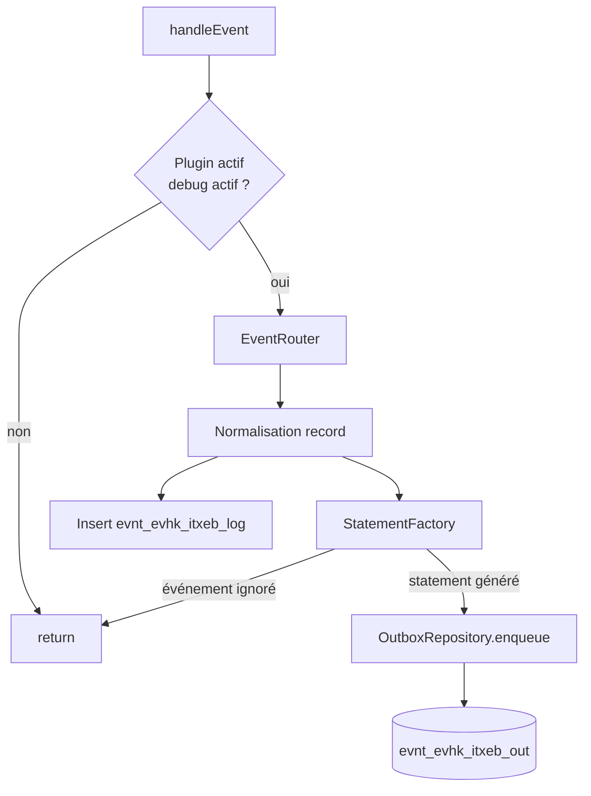

# README technique — IliasTraxEventBridge

## Type de plugin

Le plugin est un plugin ILIAS de type :

```text
Services/EventHandling/EventHook
```

Chemin d’installation attendu :

```text
public/Customizing/global/plugins/Services/EventHandling/EventHook/IliasTraxEventBridge
```

Classe principale :

```text
classes/class.ilIliasTraxEventBridgePlugin.php
```

La méthode appelée par ILIAS 10 est :

```php
public function handleEvent(string $a_component, string $a_event, array $a_parameter): void
```

## Organisation des classes

| Classe | Rôle |
|---|---|
| `ilIliasTraxEventBridgePlugin` | Point d’entrée EventHook ILIAS |
| `ilIliasTraxEventBridgeConfigGUI` | Écran de configuration du plugin |
| `ilIliasTraxEventBridgeConfig` | Lecture/écriture des paramètres via `ilSetting` |
| `ilIliasTraxEventBridgeEventRouter` | Normalisation et routage des événements ILIAS |
| `ilIliasTraxEventBridgeEventDebugRepository` | Persistance du journal brut |
| `ilIliasTraxEventBridgeStatementFactory` | Mapping événement ILIAS vers statement xAPI |
| `ilIliasTraxEventBridgeOutboxRepository` | Stockage et statut d’envoi des statements |
| `ilIliasTraxEventBridgeTraxClient` | Client HTTP xAPI/TRAX |
| `ilIliasTraxEventBridgeHttpResult` | Objet résultat HTTP |

## Flux interne



## Normalisation des événements

Le routeur tente de récupérer :

- `user_id` depuis `usr_id`, `user_id`, utilisateur global ILIAS ;
- `ref_id` depuis les paramètres ou depuis `REQUEST_URI` ;
- `obj_id` depuis les paramètres ;
- `obj_type` depuis les paramètres ou depuis `cmdClass`.

Exemples de correspondance `cmdClass` :

| `cmdClass` | `obj_type` |
|---|---|
| `ilObjFileGUI` | `file` |
| `ilTestPlayerFixedQuestionSetGUI` | `tst` |
| `ilObjCourseGUI` | `crs` |
| `ilObjWikiGUI` | `wiki` |
| `ilObjFileBasedLMGUI` | `htlm` |

## Mapping xAPI actuel

### Téléchargement de fichier

Condition :

```text
component = components/ILIAS/ILIASObject
event     = update
obj_type  = file
URI       contient cmd=sendfile
```

Statement :

```text
verb = http://adlnet.gov/expapi/verbs/experienced
event_type = file_downloaded
```

### Début de test

Condition :

```text
component = components/ILIAS/Tracking
event     = updateStatus
URI       contient cmd=startTest
```

Statement :

```text
verb = http://adlnet.gov/expapi/verbs/attempted
event_type = test_tracking_status
```

### Fin de test réussie

Condition :

```text
status = 2
ou percentage = 100
```

Statement :

```text
verb = http://adlnet.gov/expapi/verbs/passed
result.success = true
result.completion = true
```

### Fin de test échouée

Condition :

```text
status = 3
```

Statement :

```text
verb = http://adlnet.gov/expapi/verbs/failed
result.success = false
```

## Événements ignorés pour l’outbox

Ces événements restent dans `evnt_evhk_itxeb_log`, mais ne produisent pas de statement xAPI :

```text
cmdClass=ilTestParticipantsGUI
pt_action=delete_results
cmd=executeTableAction
```

Objectif : éviter d’envoyer vers TRAX des actions d’administration comme des traces d’apprentissage.

## Structure d’un statement généré

Exemple simplifié :

```json
{
  "id": "uuid",
  "actor": {
    "objectType": "Agent",
    "account": {
      "homePage": "http://ilias.example.local",
      "name": "ilias-user-328"
    }
  },
  "verb": {
    "id": "http://adlnet.gov/expapi/verbs/passed",
    "display": {
      "fr-FR": "a réussi",
      "en-US": "passed"
    }
  },
  "object": {
    "id": "http://ilias.example.local/xapi/activity/tst/ref/137",
    "objectType": "Activity"
  },
  "context": {
    "platform": "ILIAS 10"
  }
}
```

## Tables SQL

Les tables sont créées par :

```text
sql/dbupdate.php
```

### `evnt_evhk_itxeb_log`

Journal de diagnostic des événements reçus.

Cette table sert à comprendre ce qu’ILIAS émet réellement.

### `evnt_evhk_itxeb_out`

Outbox xAPI.

Statuts possibles en v0.3.1 :

```text
generated
sending
sent
failed
```

## Configuration stockée dans `settings`

Module :

```text
itxeb
```

Paramètres principaux :

| Clé | Rôle |
|---|---|
| `trax_endpoint` | Endpoint xAPI TRAX |
| `trax_username` | Identifiant client xAPI |
| `trax_password` | Secret client xAPI |
| `xapi_version` | Version xAPI |
| `http_timeout` | Timeout HTTP |
| `batch_size` | Taille d’un envoi manuel |
| `ilias_base_url` | Base URL utilisée dans les IRIs |
| `last_trax_test_*` | Dernier diagnostic test connexion |
| `last_trax_send_*` | Dernier diagnostic envoi manuel |

## Client HTTP TRAX

Classe :

```text
ilIliasTraxEventBridgeTraxClient
```

Méthodes :

```php
testConnection()
sendStatements(array $statements)
```

Requête d’envoi :

```http
POST <endpoint>/statements
Authorization: Basic <client:secret>
Content-Type: application/json
Accept: application/json
X-Experience-API-Version: 1.0.3
```

Payload :

```json
[
  {
    "actor": {},
    "verb": {},
    "object": {}
  }
]
```

## Recommandations avant production

- Ne pas envoyer prénom, nom, e-mail ou login par défaut.
- Utiliser `actor.account.name = ilias-user-<usr_id>` ou un hash.
- Utiliser HTTPS vers TRAX.
- Limiter les droits du client TRAX à l’écriture xAPI nécessaire.
- Activer un cron uniquement après validation manuelle.
- Nettoyer périodiquement les tables debug en production.
- Ajouter une gestion de rétention de l’outbox.

## Roadmap technique v0.4

- ajouter un job cron ILIAS ;
- ajouter `retry_count`, `max_retry`, `next_retry_at` ;
- différencier erreurs définitives et temporaires ;
- améliorer la configuration admin ;
- ajouter un export diagnostic ;
- ajouter une option de pseudonymisation SHA-256.
