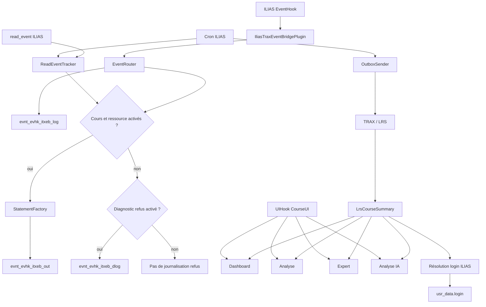

# README technique — IliasTraxEventBridge

Version stable courante après promotion : **V0.25.6** sur `main`, plugin principal **0.25.6-dev**.

Plugin compagnon UIHook : **IliasTraxEventBridgeCourseUI 0.8.44**.

## 1. Type de plugin

Le plugin principal est un plugin ILIAS de type :

```text
Services/EventHandling/EventHook
```

Chemin d'installation attendu :

```text
public/Customizing/global/plugins/Services/EventHandling/EventHook/IliasTraxEventBridge
```

Classe principale :

```text
classes/class.ilIliasTraxEventBridgePlugin.php
```

Méthode appelée par ILIAS 10 :

```php
public function handleEvent(string $a_component, string $a_event, array $a_parameter): void
```

Le plugin compagnon est un plugin ILIAS de type :

```text
Services/UIComponent/UserInterfaceHook
```

Chemin d'installation actif :

```text
public/Customizing/global/plugins/Services/UIComponent/UserInterfaceHook/IliasTraxEventBridgeCourseUI
```

## 2. Architecture courante V0.25.6


```mermaid
flowchart TD
    A[ILIAS EventHook] --> B[IliasTraxEventBridgePlugin]
    B --> C[EventRouter]
    C --> D[evnt_evhk_itxeb_log]
    C --> E{Cours et ressource activés ?}
    E -->|oui| F[StatementFactory]
    F --> G[evnt_evhk_itxeb_out]
    E -->|non| H{Diagnostic refus activé ?}
    H -->|oui| I[evnt_evhk_itxeb_dlog]
    H -->|non| J[Pas de journalisation refus]

    K[read_event ILIAS] --> L[ReadEventTracker]
    L --> E
    M[Cron ILIAS] --> L
    M --> N[OutboxSender]
    N --> O[TRAX / LRS]

    O --> P[LrsCourseSummary]
    P --> Q[Dashboard]
    P --> R[Analyse]
    P --> S[Expert]
    P --> T[Analyse IA]
    P --> U[Résolution login ILIAS]
    U --> V[usr_data.login]

    W[UIHook CourseUI] --> Q
    W --> R
    W --> S
    W --> T
```

## 3. Règle de filtrage

La règle métier est stricte :

```text
statement xAPI autorisé = cours activé ET ressource activée
```

Si le cours ou la ressource n'est pas explicitement activé, aucune ligne n'est insérée dans `evnt_evhk_itxeb_out`.

TRAX/LRS reste la source principale de lecture pédagogique. L'outbox locale reste une file technique d'envoi.

## 4. Tables SQL principales

| Table | Rôle |
|---|---|
| `evnt_evhk_itxeb_log` | Journal brut des événements EventHook reçus. |
| `evnt_evhk_itxeb_out` | Outbox locale des statements xAPI. |
| `evnt_evhk_itxeb_read` | Suivi anti-doublon des consultations issues de `read_event`. |
| `evnt_evhk_itxeb_ccfg` | Configuration xAPI par cours. |
| `evnt_evhk_itxeb_rcfg` | Configuration xAPI par ressource dans un cours. |
| `evnt_evhk_itxeb_dlog` | Diagnostic des traces refusées. |
| `evnt_evhk_itxeb_aih` | Historique local des analyses IA. |
| `usr_data` | Table ILIAS utilisée en lecture pour résoudre `ilias-user-ID` vers `login`. |

## 5. Classes principales

| Classe | Rôle |
|---|---|
| `ilIliasTraxEventBridgePlugin` | Point d'entrée EventHook ILIAS. |
| `ilIliasTraxEventBridgeConfig` | Lecture/écriture de la configuration via `ilSetting`. |
| `ilIliasTraxEventBridgeConfigGUI` | Écran admin, supervision, actions manuelles, diagnostic refus. |
| `ilIliasTraxEventBridgeEventRouter` | Normalisation, résolution cours, filtrage, outbox ou refus. |
| `ilIliasTraxEventBridgeStatementFactory` | Mapping événements/consultations vers statements xAPI. |
| `ilIliasTraxEventBridgeTestQuestionResultExtractor` | Extraction des résultats de questions de test ILIAS. |
| `ilIliasTraxEventBridgeQuestionRiskRepository` | Calcul des questions à fort taux d'échec. |
| `ilIliasTraxEventBridgeOutboxRepository` | Gestion de l'outbox, compteurs et statuts. |
| `ilIliasTraxEventBridgeOutboxSender` | Envoi xAPI manuel ou cron. |
| `ilIliasTraxEventBridgeLrsReadClient` | Lecture directe TRAX/LRS. |
| `ilIliasTraxEventBridgeLrsCourseSummary` | Construction des données Tableau de bord, Analyse, Expert et IA. |
| `ilIliasTraxEventBridgeCourseAiAnalyzer` | Préparation et envoi du payload Analyse IA. |
| `ilIliasTraxEventBridgeAiAnalysisHistory` | Historique local des analyses IA. |
| `ilIliasTraxEventBridgeReadEventTracker` | Traitement de la table ILIAS `read_event`. |

## 6. Résolution login apprenant V0.25.6

La V0.25.6 ajoute `learner_identity` dans les lignes détaillées lues depuis TRAX/LRS.

Ordre de résolution :

1. lecture de `actor.account.name` ;
2. détection du format `ilias-user-ID` ;
3. résolution via `ilObjUser::_lookupLogin()` si disponible ;
4. fallback via `$DIC->database()` ;
5. fallback via `$ilDB` ;
6. lecture de `usr_data.login` ;
7. fallback sur l'identité acteur xAPI.

Un cache local `actorLoginCache` évite de relire plusieurs fois le même `usr_id` pendant une requête.

Le `User ID` affiché dans Expert reste pseudonymisé. La colonne `Apprenant` affiche le login ILIAS.

## 7. Plugin compagnon CourseUI

Le plugin compagnon expose :

```text
Cours > Pilotage xAPI
```

Vues disponibles :

```text
Tableau de bord | Analyse | Analyse IA | Expert | Configuration | Retour contenu du cours
```

Classes générées dans le slot UIHook :

```text
class.ilIliasTraxEventBridgeCourseUIPlugin.php
class.ilIliasTraxEventBridgeCourseUIBridge.php
class.ilIliasTraxEventBridgeCourseUIScreen.php
class.ilIliasTraxEventBridgeCourseUIUIHookGUI.php
```

Dans le dépôt principal, ces fichiers sont conservés en templates `.php.tpl` pour éviter les doublons Composer :

```text
companion/IliasTraxEventBridgeCourseUI/plugin.php.tpl
companion/IliasTraxEventBridgeCourseUI/classes/*.php.tpl
```

Installation/régénération :

```bash
cd /var/www/ilias/public/Customizing/global/plugins/Services/EventHandling/EventHook/IliasTraxEventBridge
export ILIAS_ROOT="/var/www/ilias"
export HTTPD_USER="apache"
bash scripts/install_course_ui_companion_with_standalone_fix.sh
```

## 8. Installation technique V0.25.6

```bash
sudo -i

export ILIAS_ROOT="/var/www/ilias"
export HTTPD_USER="apache"
export EVENTHOOK_DIR="$ILIAS_ROOT/public/Customizing/global/plugins/Services/EventHandling/EventHook"
export PLUGIN_NAME="IliasTraxEventBridge"

mkdir -p "$EVENTHOOK_DIR"
cd "$EVENTHOOK_DIR"

git clone -b main --single-branch https://github.com/vincent-sayah/IliasTraxEventBridge.git "$PLUGIN_NAME"
cd "$PLUGIN_NAME"

grep -n '\$version' plugin.php
grep -n '\$version' companion/IliasTraxEventBridgeCourseUI/plugin.php.tpl
find . -name "*.php" -print0 | xargs -0 -n1 php -l
bash scripts/install_course_ui_companion_with_standalone_fix.sh

cd "$ILIAS_ROOT"
sudo -u "$HTTPD_USER" composer du
sudo -u "$HTTPD_USER" php cli/setup.php build --yes
systemctl restart httpd
systemctl restart php-fpm
```

Résultat attendu :

```text
$version = '0.25.6-dev';
$version = '0.8.44';
```

## 9. Contrôles techniques utiles

```bash
grep -n "0.25.6-dev\|0.8.44\|ITXEB V0.25.6 learner login resolution\|lookupIliasLogin\|usr_data\|learner_identity" \
plugin.php \
classes/class.ilIliasTraxEventBridgeLrsCourseSummary.php \
companion/IliasTraxEventBridgeCourseUI/plugin.php.tpl \
companion/IliasTraxEventBridgeCourseUI/classes/class.ilIliasTraxEventBridgeCourseUIScreen.php.tpl
```

```sql
SELECT usr_id, login
FROM usr_data
WHERE usr_id IN (6, 401);
```

```sql
SELECT status, COUNT(*) AS total
FROM evnt_evhk_itxeb_out
GROUP BY status;
```

## 10. Documentation liée

```text
README.md
CHANGELOG.md
docs/INDEX_0.25.6.md
docs/RELEASE_0.25.6.md
docs/VALIDATION_0.25.6.md
docs/INSTALLATION.md
companion/IliasTraxEventBridgeCourseUI/README.md
```
